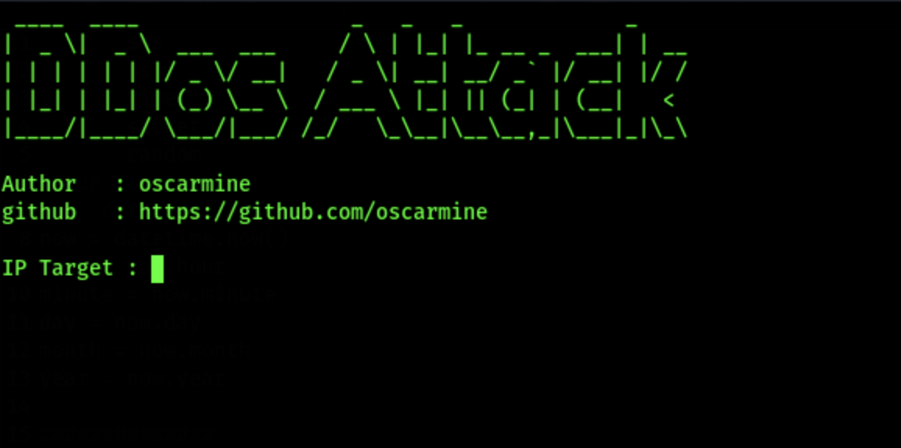

# 🛡️ DDoS Attack (Distributed Denial of Service)

A **DDoS (Distributed Denial of Service) attack** is a cyberattack where multiple compromised computers, often part of a **botnet**, flood a target server, network, or website with excessive traffic.  

This overloads the system, making it **slow** or completely **unavailable** to legitimate users.

## 🔥 How Does a DDoS Attack Work?
1. **Botnet Creation** – The attacker infects many devices with malware to control them remotely.  
2. **Traffic Flooding** – These compromised devices (bots) send massive amounts of traffic to the target.  
3. **Service Disruption** – The target system becomes overwhelmed, leading to downtime or slow performance.  

## 🚀 Common Types of DDoS Attacks
- **🔹 Volumetric Attacks** – Overload bandwidth with a flood of data (e.g., UDP flood, ICMP flood).  
- **🔹 Protocol Attacks** – Exploit weaknesses in network protocols (e.g., SYN flood, Ping of Death).  
- **🔹 Application Layer Attacks** – Target web applications to exhaust server resources (e.g., HTTP flood, Slowloris).  

## 🛑 How to Prevent DDoS Attacks
✅ Use **firewalls** and **rate limiting**.  
✅ Deploy **CDNs (Content Delivery Networks)** like Cloudflare.  
✅ Implement **DDoS mitigation services**.  
✅ Monitor network traffic for **suspicious spikes**.  

> **⚠️ Stay protected!** DDoS attacks can be devastating, but with the right security measures, you can minimize the risks.  

---
## 📥 Download & Install

Follow these steps to set up the DDoS attack script:

```bash
# Clone the Repository
git clone https://github.com/oscarmine/DDos-Attack

# Unzip the downloaded file
unzip DDos-Attack

# Navigate to the Directory
cd DDos-Attack

# Run the Script
python2 ddos-attack.py
```
🖼️ Screenshot

